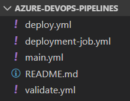
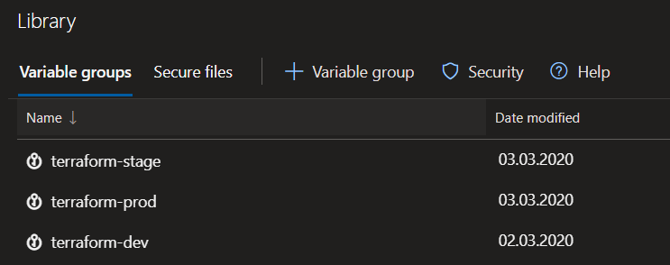
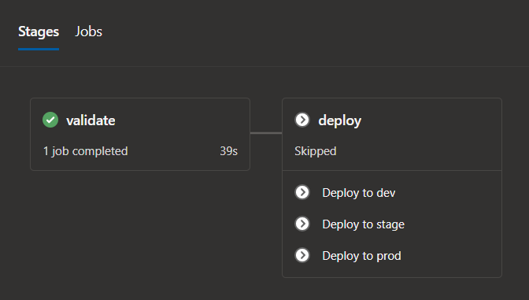

 on [Unsplash](https://unsplash.com?utm_source=medium&utm_medium=referral)](clouds.jpg)

The [multi-stage pipelines](https://docs.microsoft.com/en-us/azure/devops/pipelines/get-started/multi-stage-pipelines-experience?view=azure-devops) feature is relatively new in Azure DevOps, and it is currently in preview mode. This feature allows you to split the deployment process into multiple stages and reuse them across multiple projects. Pipelines are described in `yaml` format. In this article, I will describe how to configure the deployment of Terraform templates to provision infrastructure in Azure.

## Problem To Solve

I had an assignment to configure the deployment of Terraform templates to the three environments: development, staging, and production.

The task sounds rather simple, but I did not have prior experience with `yaml` and multi-stage pipelines.

So my journey began with reading the [documentation](https://docs.microsoft.com/en-us/azure/devops/pipelines/yaml-schema?view=azure-devops&tabs=schema%2Cparameter-schema) about `yaml` and after a while, it turned out to be the most popular resource that I have visited during the learning and implementing period.

## Template Structure

In the beginning, I created a separate Git repository for storing a deployment template that can be used by other projects.



`main.yml` is the entry point, which consists of `validate`  and `deploy`  stages.

Validate stage checks if Terraform configuration is syntactically valid. In turn, the deploy stage performs the actual deployment using deployment jobs.

## Deployment Jobs

Let’s talk about the actual code that performs deployment. According to Microsoft recommendations, I chose to use jobs of type of [deployment job](https://docs.microsoft.com/en-us/azure/devops/pipelines/yaml-schema?view=azure-devops&tabs=schema%2Cparameter-schema#deployment-job).

> Deployment jobs provide the following benefits:

> **Deployment history**: You get end-to-end deployment history across pipelines, down to a specific resource and status of the deployments for auditing.

> **Apply deployment strategy**: You define how your application is rolled out.

I picked the `runOnce` deployment strategy because it covered my use case with Terraform template deployment and also is the most simple one. Here is the example of a deployment job that employs `runOnce` strategy.

```yaml
jobs:
  - deployment: dev
    condition: startsWith(variables['Build.SourceBranch'], 'refs/heads/dev')
    displayName: Deploy to dev
    environment: dev
    variables:
      - name: environment
        value: dev
      - group: ${{ format('terraform-{0}', variables.environment) }}
      - ${{ if ne(parameters.variable_group_name, '') }}:
          - group: ${{ format('{0}-{1}', parameters.variable_group_name, variables.environment) }}
    strategy:
      runOnce:
        deploy:
          steps:
            - template: deployment-job.yml
              parameters:
                container_name: ${{ parameters.container_name }}
                container_key: ${{ parameters.container_key }}
                variable_group_name: ${{ parameters.variable_group_name }}
                environment: $(environment)
                tf_plan_name: ${{ parameters.tf_plan_name }}
                working_directory: ${{ parameters.working_directory }}
```

As you might notice, the actual deployment steps are defined in a separate template file because they are reused for each environment. Deployment job contains the following steps:

```yaml
parameters:
  container_name:
  container_key:
  variable_group_name:
  environment:
  tf_plan_name:
  working_directory:

steps:
  - checkout: self
  - task: qetza.replacetokens.replacetokens-task.replacetokens@3
    inputs:
      targetFiles: "${{ parameters.working_directory }}/environments/${{ parameters.environment }}/*.tfvars => outputs/*.tfvars"
      encoding: "auto"
      writeBOM: true
      actionOnMissing: "warn"
      keepToken: false
      tokenPrefix: "#{"
      tokenSuffix: "}"
  - bash: |
      terraform init -backend-config="storage_account_name=$(terraform-state-storage-account-name)" -backend-config="container_name=${{ parameters.container_name }}" -backend-config="key=${{ format('{0}-{1}', parameters.environment, parameters.container_key) }}" -backend-config="access_key=$(terraform-state-access-key)" -input=false
    displayName: Initialize configuration
    workingDirectory: ${{ parameters.working_directory }}

  - bash: terraform validate
    displayName: Validate configuration
    workingDirectory: ${{ parameters.working_directory }}

  - bash: |
      terraform plan -var-file="environments/${{ parameters.environment }}/outputs/variables.tfvars" -var "azure_client_secret=$(azure-client-secret)" -input=false -detailed-exitcode -out=${{ parameters.tf_plan_name }}
      echo "##vso[task.setvariable variable=has_changes]$?"
    displayName: Create execution plan
    workingDirectory: ${{ parameters.working_directory }}

  - bash: terraform apply -input=false -auto-approve ${{ parameters.tf_plan_name }}
    displayName: Apply execution plan
    condition: eq(variables.has_changes, '2')
    workingDirectory: ${{ parameters.working_directory }}
```

* Check out the source code from the repository.
* The [task to replace variable tokens](https://marketplace.visualstudio.com/items?itemName=qetza.replacetokens) with real values from the variable group. More about variable groups in the next paragraph.
* Initialize Terraform configuration that involves downloading of [azurerm](https://www.terraform.io/docs/providers/azurerm/index.html) provider, and connecting to the central [backend](https://www.terraform.io/docs/backends/types/azurerm.html) storage of Terraform state.
* Validate the Terraform template.
* Show the list of changes that will be applied to the infrastructure.
* Apply the changes if there are any.

## Variable Groups

You can use variables groups to store common deployment variables. I have utilized them to define variables such as the Azure Storage Account access key, Azure Service Principal client secret, and few more.



I did not find a better way how to separate variables by environments other than adding environment postfix to the name of the variable group.

Azure DevOps also provides a way to [link the variable group with Azure Key Vault](https://docs.microsoft.com/en-us/azure/devops/pipelines/library/variable-groups?view=azure-devops&tabs=yaml#link-secrets-from-an-azure-key-vault). To do it, you need to set up a [Service Connection](https://docs.microsoft.com/en-us/azure/devops/pipelines/library/service-endpoints?view=azure-devops&tabs=yaml#create-a-service-connection) to connect to your Azure subscription. I have used the [Azure Resource Manager (ARM)](https://docs.microsoft.com/en-us/azure/devops/pipelines/library/service-endpoints?view=azure-devops&tabs=yaml#sep-azure-resource-manager) service connection. In my opinion, it is a more robust way to store secrets because they are stored centrally and can be used in other places too.

## Putting Everything Together

In the end, I have created the following deployment pipeline:



It consists of `validate` and `deploy` stages. Deploy stage has three jobs, one for each environment. Deployment jobs are executed based on conditions involving Git repository branch names:

* `Deploy to dev` is executed when the pipeline is triggered in `refs/heads/dev*` branch.
* `Deploy to stage` is executed when the `refs/heads/rel*` branch is created.
* `Deploy to prod` is executed when `refs/heads/rel*` branch is merged into `master`.

## Template Usage Example

When you have multiple Git repositories that use a shared template, it is a good idea to store this template in the separate Git repository and reuse it.

I have added the shared deployment template here:

[Azure DevOps multi-stage deployment pipeline for Terraform configuration](https://github.com/viktors-telle/azure-devops-terraform-pipeline-template).

Below is the sample `yaml` file that uses the template defined in the repository above.

```yaml
pool: your-agent-pool-name

trigger:
  batch: true
  branches:
    exclude:
      - refs/heads/feature*

resources:
  repositories:
    - repository: azure-devops-pipelines
      type: github
      name: viktors-telle/azure-devops-pipelines
      ref: "refs/heads/master"

stages:
  - template: main.yml@viktors-telle/azure-devops-pipelines
    parameters:
      container_name: blob_container_name
      container_key: blob_file_name
      variable_group_name: project_variable_group_name
```

You can also check the sample here:

[Azure DevOps multi-stage deployment pipeline for Terraform configuration](https://github.com/viktors-telle/azure-devops-terraform-pipeline-template).

## Wrap Up

I was able to achieve the desired goal to deploy Terraform configuration to multiple environments, but multi-stage pipelines somehow feel incomplete in terms of documentation and there should also be a more convenient way to define variables groups based on different environments. Let’s see if these issues will be resolved in the final release.
